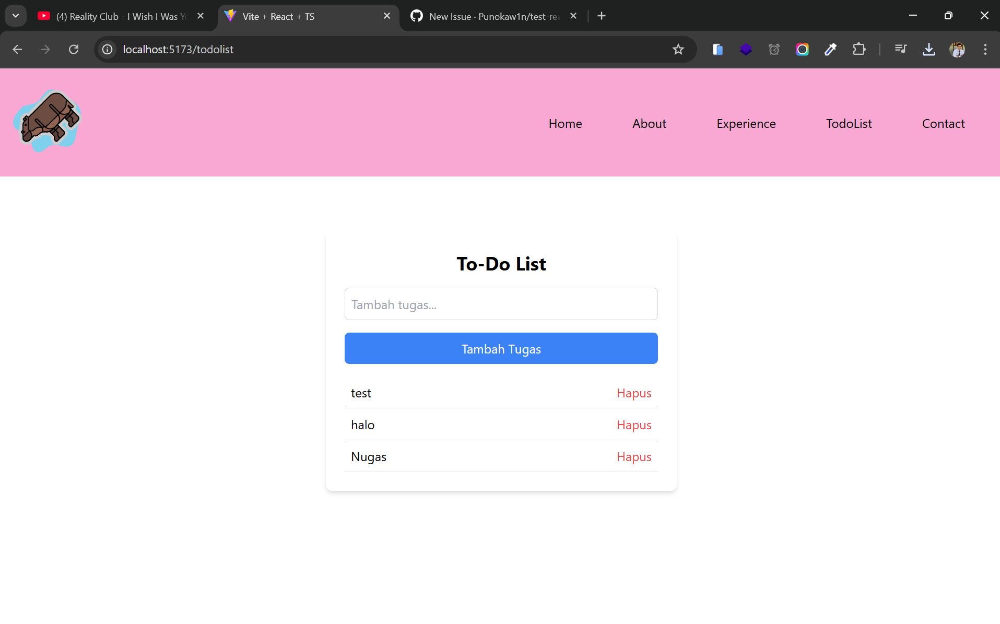
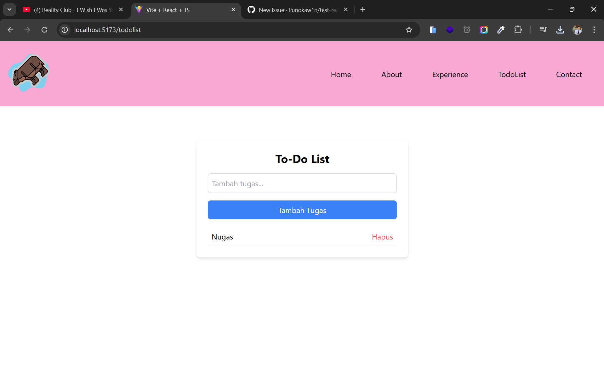
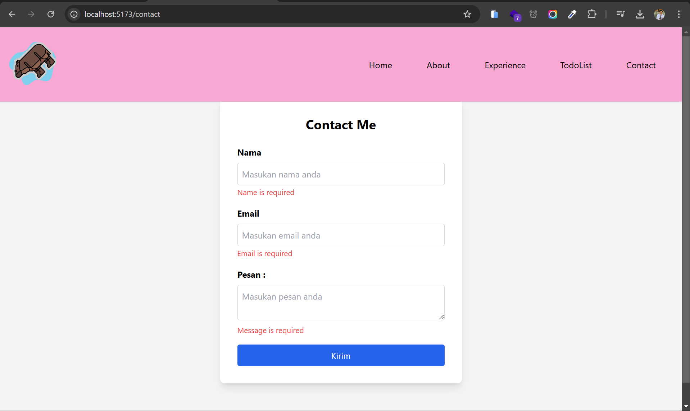
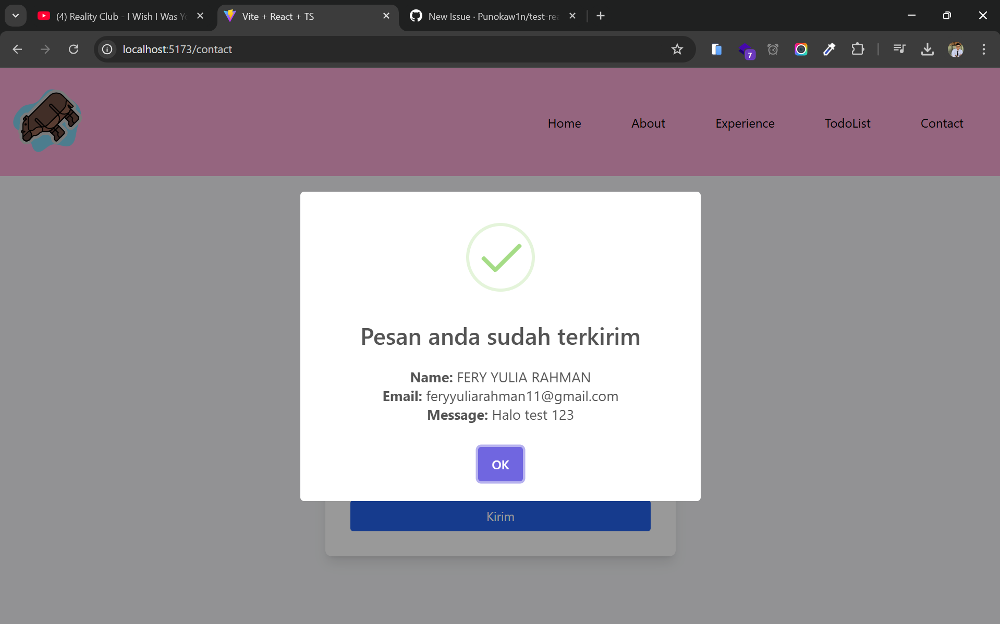

# TASK 6 REACT ROUTER DAN TAILWIND CSS

- HALAMAN HOME ATAU MAIN PAGE

- HALAMAN ABOUT ME

- HALAMAN EXPERIENCE

- HALAMAN TODOLIST

Disini saya mencoba membuat todolist sederhana dengan menggunakan usestate

- HALAMAN TODOLIST SETELAH DI DELETE

- HALAMAN CONTACT

Di halaman contact ini saya mencoba membuat form nya menggunakan formik seperti yang sudah di ajarkan, saya mencoba membuat form dengan formik dan validasi dengan yup.

- HALAMAN CONTACT SUCCESS

Di sini saya menambahkan sweet alert untuk alert dari success nya form dikirim.

